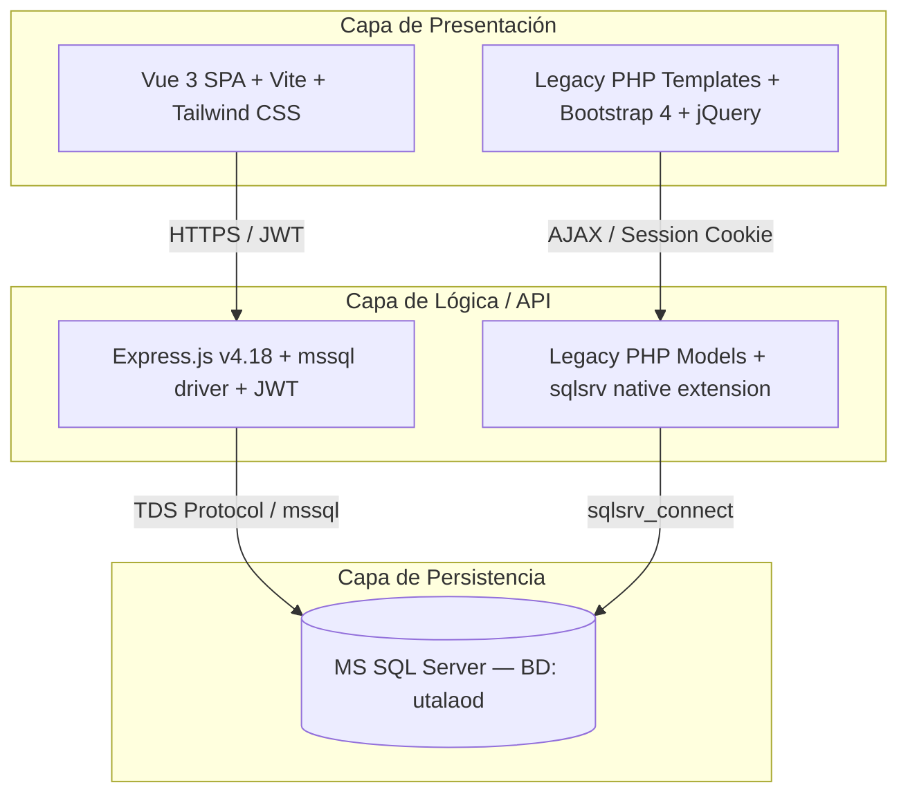
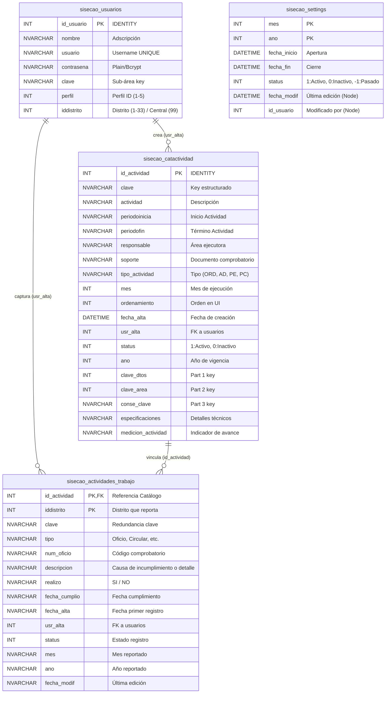

# Reporte de Diagnóstico y Análisis Técnico Completo: SISECAOD 2026

Este documento constituye el diagnóstico profundo de la plataforma de control de actividades **SISECAOD 2026**. Comprende el análisis completo de la arquitectura del software, base de datos, flujos de procesos, perfiles de usuarios y reglas de negocio. Asimismo, destaca discrepancias, brechas de seguridad y fallas críticas identificadas entre el sistema legacy (PHP) y el nuevo desarrollo (Node.js/Express y Vue 3).

---

## 1. Arquitectura General y Stack Tecnológico

El ecosistema de desarrollo consta de tres bases de código identificadas en el entorno: el sistema heredado (legacy PHP), el nuevo backend de Node.js, y el nuevo cliente SPA (Single Page Application) desarrollado en Vue 3.



### 1.1 Comparación de Stack Tecnológico

| Componente | Sistema Legacy (PHP) | Nuevo Desarrollo (Node.js + Vue 3) |
| :--- | :--- | :--- |
| **Lenguaje Backend** | PHP (versión 7.x/8.x) | JavaScript / Node.js (Runtime v18+) |
| **Framework Backend** | PHP estructurado nativo | Express.js (v4.18+) |
| **Controlador de Base de Datos** | Extensión nativa `sqlsrv` | Paquete npm `mssql` (v10+) con driver `tedious` (protocolo TDS) |
| **Mecanismo de Autenticación** | Sesiones de PHP (`session_start()`, `$_SESSION`) | JWT (JSON Web Tokens) con Access Token (memoria) y Refresh Token (cookie httpOnly) |
| **Framework Frontend** | Bootstrap 4 + HTML embebido en PHP | Vue 3 (Composition API / Script Setup) + TypeScript |
| **Estilos y Maquetación** | Bootstrap 4 + CSS personalizado + jQuery | Tailwind CSS + PostCSS |
| **Gestión de Estado Frontend** | N/A (Recargas completas o AJAX aislado con jQuery) | Pinia |
| **Librería de Componentes / Modales** | Modales de Bootstrap 4 + `alert()` nativo | SweetAlert2 (vía composable `useSweetAlert`) |
| **Generador / Lector de Excel** | `Spreadsheet_Excel_Reader` (XLS) | ExcelJS (`exceljs` en backend) |
| **Herramientas de Construcción** | N/A (Estructura de archivos directos en Apache) | Vite + TypeScript compiler |

### 1.2 Estructura del Directorio del Proyecto

#### A. Backend (Node.js / Express)
Organizado bajo un patrón estructural de **Capa de Servicios y Controladores**:

* **`src/server.js`**: Punto de entrada inicial. Inicializa la conexión a base de datos y monta el servidor Express.
* **`src/app.js`**: Configura middleware global (Helmet, CORS, Rate Limit, Express JSON) y monta las rutas.
* **`src/config/`**: Configuración e inicialización del pool de base de datos (`database.js`), lectura y validación de variables de entorno (`env.js`), y sistema de registros y depuración (`logger.js`).
* **`src/middlewares/`**: Filtros de rutas para seguridad y control de flujos:
  * `auth.middleware.js`: Valida firma JWT y extrae los datos de identidad.
  * `roles.middleware.js`: Restringe rutas verificando coincidencia con perfiles autorizados (`roleGuard`).
  * `validate.middleware.js`: Extrae y responde con formato de error si fallan las reglas de `express-validator`.
  * `error.middleware.js`: Captura excepciones globales del servidor para evitar caídas bruscas.
* **`src/routes/`**: Define los endpoints agrupados por entidad (`auth`, `settings`, `catalogo`, `seguimiento`, `reportes`, `usuarios`).
* **`src/controllers/`**: Manejadores de petición HTTP. Mapean la entrada de datos, invocan servicios y retornan respuestas estructuradas.
* **`src/services/`**: Concentra la lógica de negocio y realiza la comunicación directa SQL hacia la base de datos.
* **`src/utils/`**: Utilerías comunes como inicializadores de periodos de captura (`periodo.js`) y respuestas estándar JSON (`response.js`).
* **`uploads/`**: Directorio de almacenamiento temporal de archivos de carga (Excel).

#### B. Frontend (Vue 3 / Vite)
Sigue la estructura modular estándar de una SPA de Vue:

* **`src/main.ts`**: Punto de entrada del cliente. Carga estilos, monta la app de Vue, Pinia y Vue Router.
* **`src/App.vue`**: Componente de diseño base.
* **`src/layouts/DashboardLayout.vue`**: Esqueleto común con barra lateral, cabecera de usuario e indicadores de sesión.
* **`src/router/`**: Configura las rutas del frontend, aplicando guards basados en autenticación y perfil del usuario guardado en el store.
* **`src/stores/`**: Stores de Pinia para estado global: `auth` (datos del usuario logueado, tokens), `settings` (periodo de captura actual).
* **`src/services/api.ts`**: Cliente Axios configurado con interceptores para inyectar el header `Authorization: Bearer <token>` y gestionar la renovación automática vía Refresh Token en respuestas 401.
* **`src/views/`**: Pantallas asociadas a las vistas de la app:
  * `LoginView.vue`: Formulario de acceso con control de periodos.
  * `DashboardView.vue`: Gráficas de avance y tableros estadísticos según perfil.
  * `CatalogoView.vue`: Administración de actividades de catálogo (con modal de creación/edición).
  * `ImportarView.vue`: Interfaz de carga de catálogos mediante Excel.
  * `SeguimientoView.vue`: Registro y control mensual de cumplimiento físico por distritos.
  * `ReportesView.vue`: Descarga de reportes estructurados (.xlsx) centralizados, individuales o históricos.
  * `UsuariosView.vue`: Panel CRUD de cuentas de usuario.
  * `ConfiguracionView.vue`: Gestión del calendario de captura por mes/año.

---

## 2. Modelado de Base de Datos (SQL Server)

El motor de persistencia configurado es Microsoft SQL Server (Base de Datos: `utalaod`).



### 2.1 Diccionario Técnico de Tablas

#### Tabla: `sisecao_usuarios`
Almacena las credenciales y perfiles asignados en el sistema.
* **`id_usuario`**: `INT` (PK, IDENTITY). Identificador autoincremental de la cuenta.
* **`nombre`**: `NVARCHAR(150)` (NOT NULL). Nombre del área o usuario.
* **`usuario`**: `NVARCHAR(50)` (NOT NULL, UNIQUE). Nombre de usuario único para inicio de sesión.
* **`contrasena`**: `VARCHAR(100)` (NOT NULL). Contraseña. Soporta texto plano heredado o Hash Bcrypt (inician con `$2`).
* **`clave`**: `VARCHAR(20)` (NULL). Clave de sub-área, usada para el filtrado en Perfil 4.
* **`perfil`**: `INT` (NOT NULL). Nivel de perfil asignado (1 a 5).
* **`iddistrito`**: `INT` (NOT NULL). ID del distrito al que pertenece el usuario (1 a 33 para distritos físicos, 99 para central).

#### Tabla: `sisecao_settings`
Determina las ventanas de tiempo mensuales en las que el sistema se mantiene abierto para captura de avance físico.
* **`mes`**: `INT` (PK). Mes calendario (1 al 12).
* **`ano`**: `INT` (PK). Año fiscal/vigencia correspondiente al calendario.
* **`fecha_inicio`**: `DATETIME` (NOT NULL). Fecha y hora a partir de la cual se abre el portal de captura.
* **`fecha_fin`**: `DATETIME` (NOT NULL). Fecha límite para realizar modificaciones.
* **`status`**: `INT` (DEFAULT 0). Estado de la ventana de captura. (1 = Abierta/Activa, 0 = Inactiva, -1 = Pasada).
* **`fecha_modif`**: `DATETIME` (NULL). Registra el instante de la última modificación en configuraciones.
* **`id_usuario`**: `INT` (NULL). Guarda la referencia del Administrador de Configuración (Perfil 5) que actualizó los periodos.

#### Tabla: `sisecao_catactividad`
Catálogo estructurado de metas o actividades anuales a desarrollar.
* **`id_actividad`**: `INT` (PK, IDENTITY). ID interno de la actividad.
* **`clave`**: `VARCHAR(20)` (NOT NULL). Clave estructurada única de la actividad (ej. `01-02-03`).
* **`actividad`**: `NVARCHAR(500)` (NOT NULL). Descripción explícita de la meta.
* **`periodoinicia`**: `VARCHAR(50)` (NULL). Texto libre que describe la fecha en la que debe iniciar la tarea.
* **`periodofin`**: `VARCHAR(50)` (NULL). Texto libre con el límite de entrega ordinario de la tarea.
* **`responsable`**: `NVARCHAR(200)` (NULL). Nombre de la subdirección o área responsable.
* **`soporte`**: `VARCHAR(100)` (NULL). Evidencia física esperada (ej. "OFICIO", "MINUTA").
* **`tipo_actividad`**: `VARCHAR(10)` (NULL). Clasificación (`ORD` = Ordinaria, `AD` = Adicional, `PE` = Proceso Electoral, `PC` = Participación Ciudadana).
* **`mes`**: `INT` (NOT NULL). Mes de ejecución esperado.
* **`ordenamiento`**: `INT` (NULL). Secuencial para visualización indexada.
* **`fecha_alta`**: `DATE` (DEFAULT GETDATE()). Registro histórico de creación.
* **`usr_alta`**: `INT` (FK -> `sisecao_usuarios`). Creador de la actividad.
* **`status`**: `INT` (DEFAULT 1). Estado de la actividad (1 = Activo, 0 = Inactivo / Soft Deleted).
* **`ano`**: `INT` (NOT NULL). Año del ejercicio presupuestal.
* **`clave_dtos`**: `INT` (NULL). Parte numérica 1 de la clave (distrito u origen).
* **`clave_area`**: `INT` (NULL). Parte numérica 2 de la clave (área de adscripción).
* **`conse_clave`**: `VARCHAR(10)` (NULL). Consecutivo interno final de la clave.
* **`especificaciones`**: `NVARCHAR(500)` (NULL). Requerimientos adicionales.
* **`medicion_actividad`**: `VARCHAR(200)` (NULL). Nombre del indicador / métrica de cumplimiento.

#### Tabla: `sisecao_actividades_trabajo`
Control del estado físico de avance de cada actividad de catálogo reportado individualmente por cada uno de los 33 distritos.
* **`id_actividad`**: `INT` (PK, FK -> `sisecao_catactividad`). ID de la actividad asociada.
* **`iddistrito`**: `INT` (PK). Identificador del órgano desconcentrado que reporta (1 al 33).
* **`clave`**: `VARCHAR(20)` (NOT NULL). Copia de la clave para búsquedas optimizadas.
* **`tipo`**: `VARCHAR(20)` (NULL). Soporte real enviado (ej. "OFICIO").
* **`num_oficio`**: `VARCHAR(100)` (NULL). Folio o número identificador del oficio o soporte.
* **`descripcion`**: `NVARCHAR(MAX)` (NULL). Justificación lógica detallada (si se reporta como "NO" realizado) o notas del cumplimiento (si "SI" se realizó).
* **`realizo`**: `VARCHAR(3)` (NOT NULL). Estado físico del cumplimiento: `"SI"` o `"NO"`.
* **`fecha_cumplio`**: `VARCHAR(20)` (NULL). Fecha reportada en que se ejecutó físicamente la actividad.
* **`fecha_alta`**: `VARCHAR(20)` (NULL). Fecha del servidor en que se insertó el avance.
* **`usr_alta`**: `INT` (FK -> `sisecao_usuarios`). ID de la cuenta que grabó el registro.
* **`status`**: `INT` (DEFAULT 1). Estado de validez del registro.
* **`mes`**: `INT` (NOT NULL). Periodo de captura en el que se asentó el reporte.
* **`ano`**: `INT` (NOT NULL). Año en el que se asentó el reporte.
* **`fecha_modif`**: `VARCHAR(20)` (NULL). Fecha del servidor de la última actualización.

---

## 3. Matriz de Roles y Permisos (RBAC)

El acceso del sistema se controla mediante los perfiles asociados a cada cuenta de usuario. La siguiente tabla mapea el alcance de cada perfil sobre la base de datos y la interfaz del usuario:

| Perfil ID | Nombre de Rol | Módulos Visibles | Permisos de Escritura / Mutación | Restricciones de Datos |
| :---: | :--- | :--- | :--- | :--- |
| **1** | **Administrador Central** | Menú Completo, Dashboard General, Catálogo, Importación, Seguimiento, Reportes Consolidados. | Total (CRUD completo en Actividades, Carga Masiva desde Excel, Edición manual, Creación de actividades adicionales). | Sin restricciones. Consulta la información consolidada de los 33 distritos. |
| **2** | **Responsable de Área (Consultor)** | Dashboard, Reportes Consolidados, Buscador de Catálogo. | Lectura Exclusiva (Solo descarga de reportes y visualización de estatus). | No puede registrar avances, configurar periodos, ni alterar el catálogo de actividades. |
| **3** | **Capturista Distrital** | Panel de Avance del Distrito, Captura de Seguimiento, Reporte de Pendientes del Distrito. | Escritura Condicionada (Solo guarda o edita registros de cumplimiento físico de su propio distrito). | **Crítica**: Solo puede escribir si el día actual está dentro del periodo activo de `sisecao_settings`. Limitado estrictamente a su distrito (`iddistrito` de su JWT). |
| **4** | **Área Específica (Sub-Admin)** | Dashboard, Catálogo, Seguimiento y Reportes limitados a su sub-área. | Escritura Parcial (Crea, edita o borra actividades del catálogo solo si pertenecen a su clave). | Limitado a nivel SQL por medio del filtro: `SUBSTRING(clave, 4, 2) = @clave` (obtenida de su perfil). |
| **5** | **Administrador de Configuración** | Catálogo de Usuarios (CRUD), Editor del Calendario Mensual (`settings`). | Escritura en Configuración (Edita rangos de fecha de captura de periodos e inserta/edita usuarios). | Solo administra el motor de accesos y el calendario; no edita directamente catálogos de actividades o avances físicos. |

---

## 4. Procesos y Flujos de Ejecución

### 4.1 Proceso: Autenticación de Usuarios (`/api/v1/auth/login`)
Controla el acceso al sistema aplicando filtros de fechas para los capturistas distritales.

```
[Cliente: Envía usuario y contrasena]
                  │
                  ▼
       [Query SQL: Obtener usuario]
                  │
                  ├─► (No existe) ──► Retorna 401 (Credenciales incorrectas)
                  │
                  ▼
  [Evalúa tipo: ¿Hash Bcrypt o Plano?]
                  │
                  ├─► (Bcrypt) ──► bcrypt.compare(contrasena, BD)
                  └─► (Plano)  ──► contrasena == BD
                  │
                  ├─► (Falso) ──► Retorna 401 (Credenciales incorrectas)
                  │
                  ▼
      [Valida Perfil del Usuario]
                  │
                  ├─► (perfil == 3: Capturista Distrital)
                  │         │
                  │         ▼
                  │   [Query SQL: Consultar sisecao_settings]
                  │   ¿Está la fecha actual del servidor en la ventana (fecha_inicio y fecha_fin)?
                  │         │
                  │         ├─► (No hay periodo activo) ──► Retorna 401 (Sistema cerrado)
                  │         └─► (Periodo Abierto) ────────► (Continúa flujo)
                  │
                  ▼
      [Generación de Tokens (JWT)]
         - Access Token (Expira en 8h)
         - Refresh Token (Expira en 7d)
                  │
                  ▼
[Retorna JSON con Access Token y escribe Refresh Token en cookie HttpOnly]
```

### 4.2 Proceso: Captura de Avance de Actividad (`/api/v1/seguimiento`)
Permite a los Capturistas Distritales guardar o actualizar el estado de cumplimiento mensual de una actividad.

```
[Capturista: Envía idActividad, realizo (SI/NO), tipoDocumento, numeroDocumento, fechaCumplimiento, observacion]
                                              │
                                              ▼
                             [Validación de Reglas de Entrada]
                                 ¿Es realizo = 'SI'?
                                      ├─► SI: Requiere tipoDocumento, numeroDocumento y fechaCumplimiento.
                                      └─► NO: Requiere observacion (justificación de causa).
                                              │
                                              ▼
                             [Verificar periodo en Servidor]
                      Query: ¿Servidor en fecha_inicio y fecha_fin activa?
                                              │
                                              ├─► (No activa) ──► Retorna 403 (Sistema cerrado)
                                              ▼
                             [Obtener Clave de Actividad en BD]
                                              │
                                              ▼
                             [Buscar registro previo de avance]
               ¿Existe registro para idActividad e iddistrito del Capturista?
                                              │
                       ┌──────────────────────┴──────────────────────┐
                       │ (No Existe)                                 │ (Sí Existe)
                       ▼                                             ▼
             [INSERT SQL en trabajo]                       [UPDATE SQL en trabajo]
             Establece status = 1                          Actualiza campos y
             Copia mes/año del periodo                     asienta fecha_modif = hoy
                                              │
                                              ▼
                                 [Retorna Éxito en JSON]
```

### 4.3 Proceso: Importación Masiva de Catálogo (`/api/v1/catalogo/importar`)
Permite al Administrador Central subir un archivo Excel (.xlsx o .xls) con las metas anuales y recrear la estructura del catálogo.

```
[Admin: Sube archivo Excel]
            │
            ▼
    [Multer guarda en uploads/]
            │
            ▼
  [ExcelJS abre el archivo]
            │
            ▼
[Obtiene mes y año activo de settings]
            │
            ▼
  [Inicia Transacción SQL Server]
            │
            ▼
  [Bucle iterativo por fila (i >= 2)] ──► Lee Clave, Actividad, Fechas, Responsable, Soporte...
            │
            ▼
  [INSERT SQL en sisecao_catactividad]
            │
            ▼
  [Termina Bucle y Ejecuta COMMIT]
            │
            ├─► (Éxito) ──► Elimina temporal ──► Retorna conteo de insertados
            └─► (Error) ──► Ejecuta ROLLBACK ──► Elimina temporal ──► Lanza Excepción 500
```

---

## 5. Análisis de Brechas, Fallas Críticas y Omisiones en el Nuevo Backend

Durante la revisión exhaustiva línea por línea del nuevo código en Node.js en comparación con el legado de PHP, se detectaron fallas críticas de compilación en caliente, problemas de seguridad y omisiones graves de reglas de negocio que impedirían una migración exitosa sin antes ser corregidas.

### 5.1 Falla Crítica en Servicio de Importación (ReferenceError)
* **Archivo afectado**: [`backend/src/services/catalogo.service.js` (Líneas 124-125)](file:///c:/xampp/htdocs/2026/daod2026/backend/src/services/catalogo.service.js#L124-L125)
* **Código actual**:
  ```javascript
  if (!pool) throw new Error('Pool de BD no inicializado. Llama connectDb() primero.')
  const transaction = new sql.Transaction(pool)
  ```
* **Diagnóstico**: `pool` es una variable definida de forma privada y local en [`backend/src/config/database.js`](file:///c:/xampp/htdocs/2026/daod2026/backend/src/config/database.js). En `catalogo.service.js` solo se importan `{ query, sql }` desde dicho archivo. Dado que `pool` no está importado ni declarado en el contexto de la importación, intentar llamar a la ruta `/importar` causará un bloqueo inmediato del proceso debido a un error `ReferenceError: pool is not defined`.
* **Solución requerida**: Exponer el objeto `pool` en los exports de `database.js` e importarlo en `catalogo.service.js`.

### 5.2 Omisión de Desactivación de Catálogos Previos al Importar
* **Archivo afectado**: [`backend/src/services/catalogo.service.js` (Línea 110: `importarExcel`)](file:///c:/xampp/htdocs/2026/daod2026/backend/src/services/catalogo.service.js#L110)
* **Diagnóstico**: En el sistema legacy ([`modelo-import-cat-new.php` Líneas 32-35](file:///c:/xampp/htdocs/2026/se_daod_v2/inc/modelos/modelo-import-cat-new.php#L32-L35)), al cargar un nuevo Excel se ejecutaba:
  ```php
  $sql = "UPDATE sisecao_catactividad SET status = 0 WHERE status = 1";
  $sql = "UPDATE sisecao_actividades_trabajo SET status = 0 WHERE status = 1";
  ```
  Esto desactivaba de forma segura todo el catálogo actual para evitar duplicidades o inconsistencias. El backend en Node.js **omite completamente esta limpieza**, por lo que la importación sumaría registros indefinidamente y causaría claves duplicadas visibles para los distritos.
* **Solución requerida**: Añadir consultas de actualización de estado (`status = 0`) para `sisecao_catactividad` y `sisecao_actividades_trabajo` dentro de la transacción de importación antes de iniciar la inserción masiva.

### 5.3 Ausencia de Encriptación de Contraseñas en el CRUD de Usuarios
* **Archivo afectado**: [`backend/src/services/usuarios.service.js` (Líneas 13-30 y 32-56)](file:///c:/xampp/htdocs/2026/daod2026/backend/src/services/usuarios.service.js#L13-L30)
* **Diagnóstico**: Aunque el middleware de autenticación del backend (`auth.service.js`) verifica si la contraseña empieza con `$2` para validarla con Bcrypt, la creación o modificación de usuarios en `usuarios.service.js` **guarda la contraseña enviada en texto plano** de forma directa en el parámetro `@contrasena`.
* **Solución requerida**: Aplicar `await bcrypt.hash(contrasena, 10)` en la creación y actualización de usuarios si se incluye una nueva contraseña.

### 5.4 Mapeo Erróneo de Columnas de Excel en la Importación
* **Archivo afectado**: [`backend/src/services/catalogo.service.js` (Líneas 143-144)](file:///c:/xampp/htdocs/2026/daod2026/backend/src/services/catalogo.service.js#L143-L144)
* **Diagnóstico**:
  * El nuevo código asigna el mes leyendo la celda 8 (`row.getCell(8).value`). Sin embargo, en el Excel estándar legacy, la columna H (Celda 8) almacena el **ordenamiento**, y la columna I (Celda 9) suele dejarse vacía. El mes no viene como columna en el Excel; es inyectado desde la ventana activa obtenida del sistema.
  * El nuevo código intenta mapear `mes` desde el Excel directamente, lo cual causará que se guarden números no válidos de meses o valores desordenados.
* **Solución requerida**: Asignar el parámetro `mes` obtenido de la configuración activa del sistema en vez de recuperarlo de la celda de Excel.

### 5.5 Omisión de la Columna `medicion_actividad` (Indicadores de Avance)
* **Archivo afectado**: [`backend/src/services/catalogo.service.js`](file:///c:/xampp/htdocs/2026/daod2026/backend/src/services/catalogo.service.js)
* **Diagnóstico**: El sistema legacy mapeaba e insertaba una columna llamada `medicion_actividad` (columna N en el Excel), que corresponde al indicador físico (ej. "Porcentaje", "Reporte"). El nuevo servicio omite por completo esta columna en la base de datos durante la importación y la creación manual, perdiendo la regla de negocio que describe bajo qué métrica se mide la actividad.

---

## 6. Lógica Estructurada para Reimplementación Completa

Para asegurar una migración exitosa sin pérdida de reglas de negocio, se asientan las estructuras lógicas de las operaciones críticas del sistema.

### 6.1 Algoritmo de Registro de Avance Mensual (Guardado de Seguimiento)
El siguiente pseudocódigo representa la lógica transaccional requerida al registrar o modificar el estado de avance mensual por parte de un distrito:

```python
FUNCTION registrar_avance_distrital(usuario_sesion, id_actividad, realizo_si_no, tipo_doc, numero_doc, fecha_cump, justificacion):
    # 1. Validaciones Iniciales de Perfil y Estructura
    IF usuario_sesion.perfil != 3 AND usuario_sesion.perfil != 1:
        RETURN ERROR("No autorizado", status=403)
        
    IF realizo_si_no == "SI" AND (tipo_doc IS EMPTY OR numero_doc IS EMPTY OR fecha_cump IS EMPTY):
        RETURN ERROR("Campos de soporte requeridos si la actividad se realizó", status=400)
        
    IF realizo_si_no == "NO" AND (justificacion IS EMPTY):
        RETURN ERROR("La justificación de incumplimiento es obligatoria si no se realizó la actividad", status=400)

    # 2. Validación Temporal de Periodos (Regla de Bloqueo Crítica)
    periodo_activo = DB.query_first("
        SELECT mes, ano FROM sisecao_settings 
        WHERE CURRENT_TIMESTAMP BETWEEN fecha_inicio AND fecha_fin AND status = 1
    ")
    
    IF periodo_activo IS NULL:
        RETURN ERROR("El periodo de captura se encuentra cerrado en esta fecha", status=403)

    # 3. Recuperación de la clave de catálogo original
    actividad_cat = DB.query_first("
        SELECT clave FROM sisecao_catactividad 
        WHERE id_actividad = id_actividad AND status = 1
    ")
    IF actividad_cat IS NULL:
        RETURN ERROR("Actividad no encontrada en el catálogo activo", status=404)

    # 4. Inserción o Actualización Condicionada (Upsert)
    registro_previo = DB.query_first("
        SELECT COUNT(*) as conteo FROM sisecao_actividades_trabajo 
        WHERE id_actividad = id_actividad AND iddistrito = usuario_sesion.id_distrito
    ")

    fecha_hoy = CURRENT_DATE()

    IF registro_previo.conteo == 0:
        # Registro Inicial
        DB.execute("
            INSERT INTO sisecao_actividades_trabajo 
            (id_actividad, clave, iddistrito, tipo, num_oficio, descripcion, realizo, fecha_cumplio, fecha_alta, usr_alta, status, mes, ano)
            VALUES 
            (id_actividad, actividad_cat.clave, usuario_sesion.id_distrito, tipo_doc, numero_doc, justificacion, realizo_si_no, fecha_cump, fecha_hoy, usuario_sesion.id_usuario, 1, periodo_activo.mes, periodo_activo.ano)
        ")
        RETURN SUCCESS("Registro de avance creado exitosamente")
    ELSE:
        # Modificación de Avance Existente
        DB.execute("
            UPDATE sisecao_actividades_trabajo
            SET tipo = tipo_doc,
                num_oficio = numero_doc,
                descripcion = justificacion,
                realizo = realizo_si_no,
                fecha_cumplio = fecha_cump,
                fecha_modif = fecha_hoy,
                usr_alta = usuario_sesion.id_usuario
            WHERE id_actividad = id_actividad AND iddistrito = usuario_sesion.id_distrito
        ")
        RETURN SUCCESS("Registro de avance actualizado exitosamente")
END FUNCTION
```

### 6.2 Algoritmo de Carga e Importación Masiva de Catálogo (Excel)
Aplica control transaccional íntegro para evitar estados intermedios inconsistentes:

```python
FUNCTION importar_catalogo_excel(usuario_sesion, archivo_excel_path):
    IF usuario_sesion.perfil != 1:
        RETURN ERROR("Acceso exclusivo para el Administrador Central", status=403)
        
    # Obtener el periodo y año configurado para saber dónde asentar las nuevas actividades
    periodo_activo = DB.query_first("
        SELECT MAX(mes) as mes, ano FROM sisecao_settings 
        WHERE status = 1 
        GROUP BY ano
    ")
    IF periodo_activo IS NULL:
        RETURN ERROR("No existe una configuración de periodos activa en el sistema", status=500)

    # Iniciar bloque transaccional explícito
    DB.begin_transaction()
    
    TRY:
        # 1. Limpieza de datos activos previos (Regla de negocio heredada)
        DB.execute("UPDATE sisecao_catactividad SET status = 0 WHERE status = 1")
        DB.execute("UPDATE sisecao_actividades_trabajo SET status = 0 WHERE status = 1")
        
        # 2. Carga del archivo Excel
        filas_excel = ExcelReader.read_rows(archivo_excel_path)
        insertados_count = 0
        
        # Omitir fila 1 (Cabecera del Excel)
        FOR i FROM 2 TO filas_excel.length:
            fila = filas_excel[i]
            
            # Condición de salida si la fila está en blanco
            IF fila.cell(1) IS EMPTY:
                BREAK
                
            # Procesamiento de Claves Compuestas
            clave_completa = fila.cell(1).text.trim()
            partes_clave = clave_completa.split('-')
            
            clave_dtos = partes_clave[0] # Parte 1 (ej. 01)
            clave_area = partes_clave[1] # Parte 2 (ej. 02)
            conse_clave = partes_clave[2] # Parte 3 (ej. 03)
            
            actividad_desc = fila.cell(2).text.trim()
            periodo_inicio = fila.cell(3).text.trim()
            periodo_fin = fila.cell(4).text.trim()
            responsable = fila.cell(5).text.trim()
            soporte = fila.cell(6).text.trim()
            tipo_actividad = fila.cell(7).text.trim()
            ordenamiento = fila.cell(8).number_value()
            especificaciones = fila.cell(13).text.trim()
            medicion = fila.cell(14).text.trim() # Columna N
            
            fecha_alta = CURRENT_TIMESTAMP()
            
            # Inserción en catálogo
            DB.execute("
                INSERT INTO sisecao_catactividad 
                (clave, actividad, periodoinicia, periodofin, responsable, soporte, tipo_actividad, mes, ordenamiento, fecha_alta, usr_alta, status, ano, clave_dtos, clave_area, conse_clave, especificaciones, medicion_actividad)
                VALUES 
                (clave_completa, actividad_desc, periodo_inicio, periodo_fin, responsable, soporte, tipo_actividad, periodo_activo.mes, ordenamiento, fecha_alta, usuario_sesion.id_usuario, 1, periodo_activo.ano, clave_dtos, clave_area, conse_clave, especificaciones, medicion)
            ")
            
            insertados_count += 1
            
        # Confirmación de la transacción al completar todas las filas
        DB.commit_transaction()
        RETURN SUCCESS(f"Se importaron {insertados_count} actividades correctamente")
        
    CATCH exception:
        # Rollback absoluto ante cualquier error de estructura
        DB.rollback_transaction()
        RETURN ERROR(f"Fallo en la importación masiva: {exception.message}", status=500)
    FINALLY:
        # Limpieza de archivos temporales en disco
        Disk.delete_file(archivo_excel_path)
END FUNCTION
```
